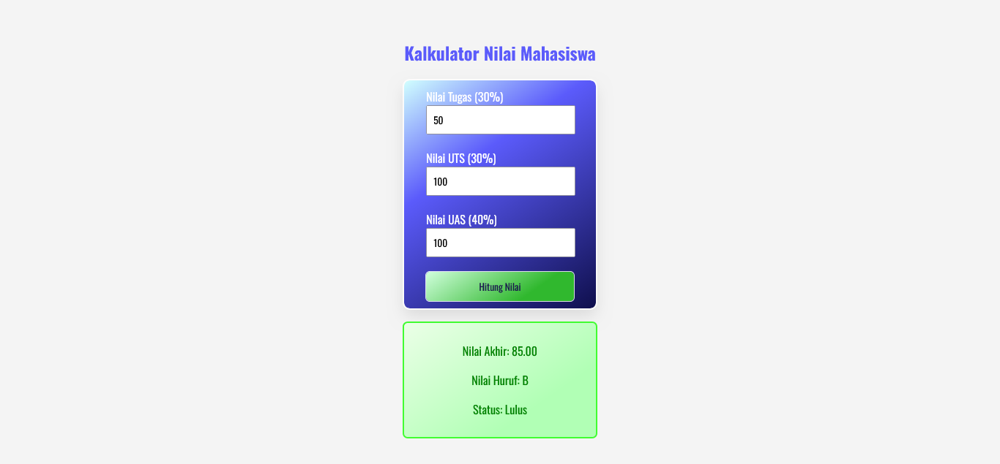

# Kalkulator Nilai Mahasiswa Sederhana

Project ini merupakan pemenuhan tugas Praktikum Pemrograman Web. Saya menggunakan desain Modern & Minimalist Style. Warna yang saya angkat adalah Oceanic Blue dengan gradasi yang enak untuk dilihat.

## Tech Stack

1. JavaScript
2. HTML
3. CSS

## Preview

### Beranda

### Ketika Hasil Sukses

### Ketika Hasil Gagal

